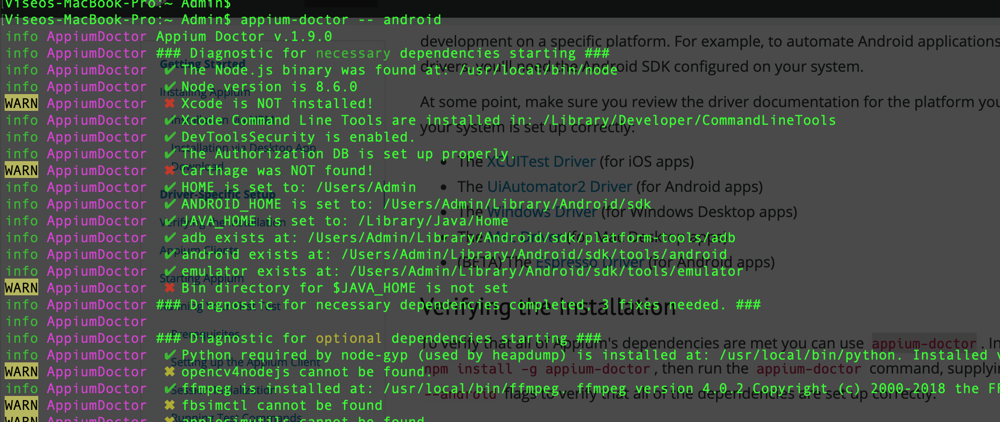
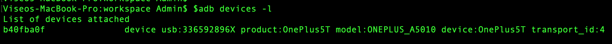
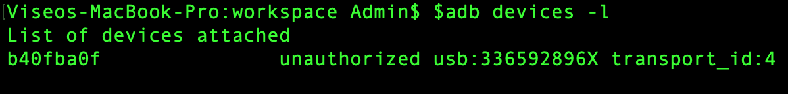
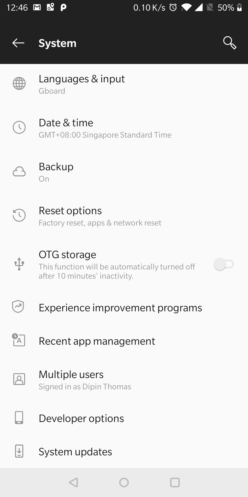
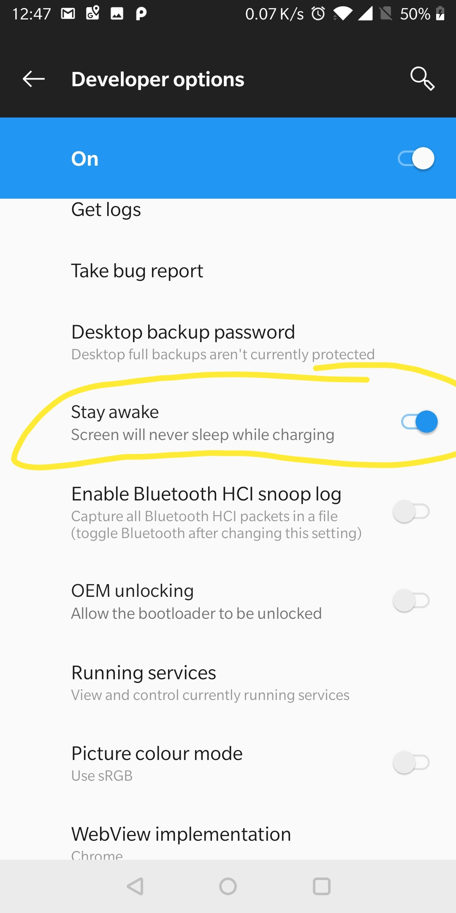
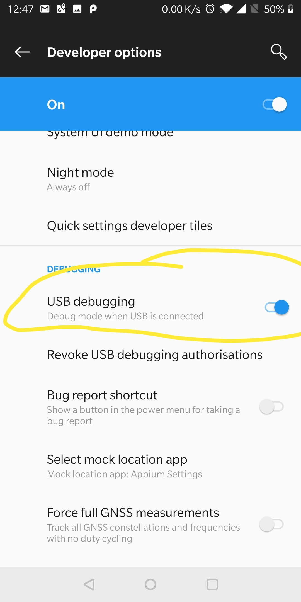
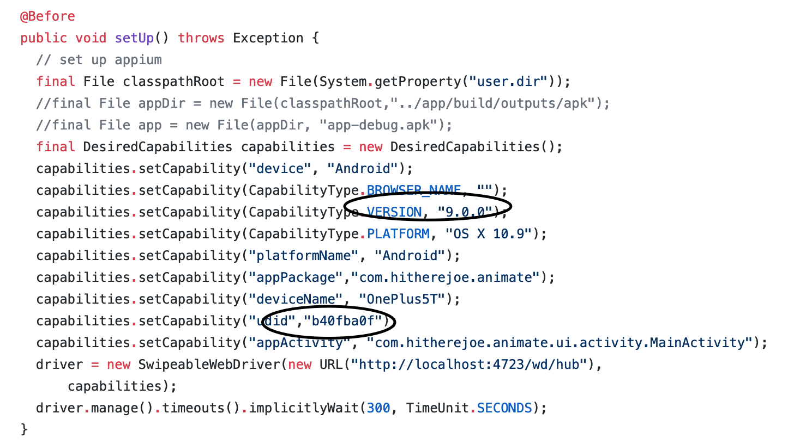
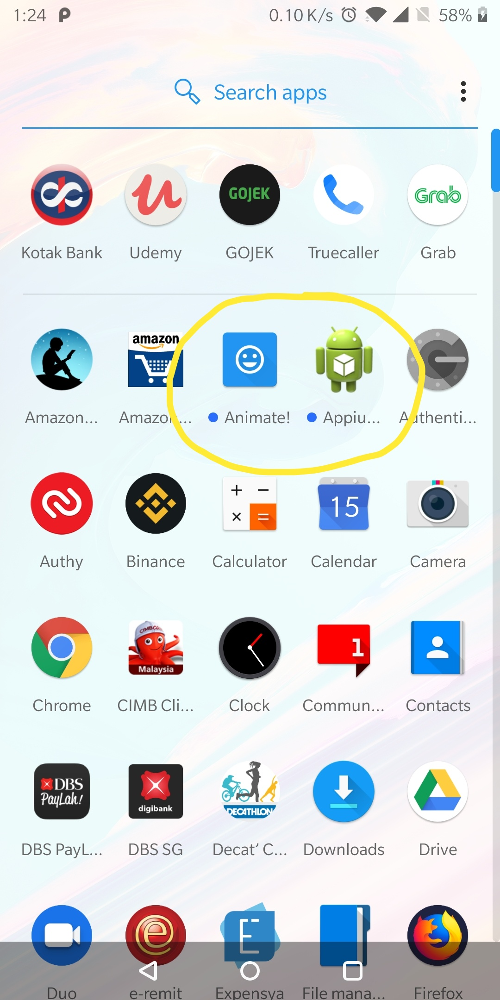

Introduction
------------

This demonstration will showcase the principles of continuous integration, continuous testing and continuous delivery of a simple mobile application.

Requirements
------------
 1. A Jenkins master server.
 
 2. A Jenkins agent(preferably running on MacOSX) with the following installed:
 * Java
 * [Android SDK](http://developer.android.com/sdk/index.html) with:
    - Android [5.1 (API 22) ](http://developer.android.com/tools/revisions/platforms.html#5.1).
    - Android SDK Tools
    - Android SDK Build tools 23.0.0.0 rc3
    - Android Support Repository
    - Android Support libraries
    - Android mobile test device running Android >=5.0

 * [Appium](http://appium.io/)
    - Follow this [link ](http://appium.io/docs/en/about-appium/getting-started/) to make sure appium is installed.

## Environment Variable

It's very important to  set environment variable for this code to work. Login to your laptop terminal and create fil /home/<user>/.bash_profile
and add below content. If location is different update accordingly. 

```
export JAVA_HOME=/Library/Java/Home
export ANDROID_HOME=/Users/Admin/Library/Android/sdk
export adb=$ANDROID_HOME/platform-tools/adb
```
    
After you have set the bash_profile, close the terminal and reopen. Test as below and make sure java and android home has some content, else something is     wrong, fix it to proceed.

```
echo $JAVA_HOME
echo $ANDROID_HOME
$adb
```
   
     
## appium-doctor check
  
appium-doctor check is very import to make sure testing environment is ready.  After installing appium as per below link you need to run.


```
appium-doctor
```  

output show look like below, please pay attention to 

 * **ANDROID_HOME**
 * **JAVA_HOME**
 * **adb**
 * **android exists**
 * **emulator exists**
   
   


## List connected device

Enable developer mode on your mobile this [link](https://www.digitaltrends.com/mobile/how-to-get-developer-options-on-android/) should help.
connect the mobile to laptop and execute below command. 

```
$adb devices -l
```

expected output




if you get below output, basically you need to accept the laptop on your mobile screen.


   

## Few more mobile settings as below screenshot

#Developer Mode Enabled



#Developer Stay Awake Setting



#Developer USB Debugging




Update Code Before Test
-----------------------

## Android SDK location

You need to update android sdk location in [gradle.properties](https://github.com/viseo-asia/devops-mobile-demo/blob/master/gradle.properties).

```
sdk.dir=/Users/Admin/Library/Android/sdk
```


## Device details on which test has to be performed

[appiumtest.java](https://github.com/viseo-asia/devops-mobile-demo/blob/master/appium-test/src/test/java/org/hello/AppiumTest.java) needs to be updated with device ID found in output **$adb devices -l**.  Updated file would look like below.




## Final Result

If build is successful you should be able see these app in your mobile.



